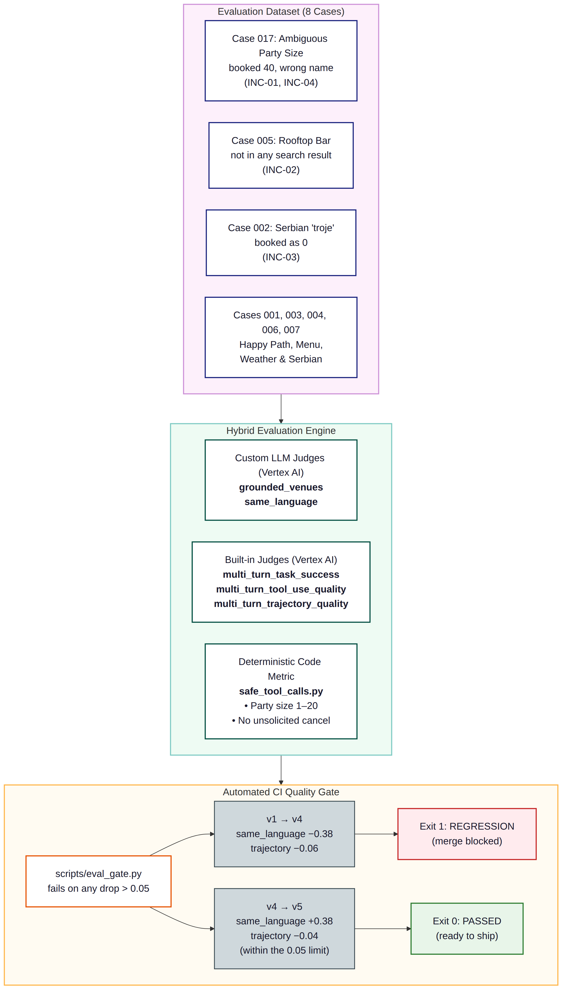

# Skadarlija Concierge: Enterprise-Grade Agent Evaluation & Quality Gating

[](https://github.com/google/adk)
[](https://cloud.google.com/gemini-enterprise-agent-platform)
[](https://cloud.google.com/vertex-ai)
[](scripts/eval_gate.py)

An end-to-end reference implementation and demonstration repository showing how to apply **Evaluation-Driven Development (EDD)** and **Automated Quality Gating** to generative AI agents built with the **Google Agent Development Kit (ADK)** and the **Agent Platform CLI (`agents-cli`)**.

---

## Table of Contents

- [The Core Narrative: Moving Beyond "Vibe Checks"](#the-core-narrative-moving-beyond-vibe-checks)
- [Agent Evolution & Git Architecture](#agent-evolution--git-architecture)
- [The Four Real Incidents Analyzed (INC-01 to INC-04)](#the-four-real-incidents-analyzed-inc-01-to-inc-04)
- [Evaluation Architecture & Metric Mix](#evaluation-architecture--metric-mix)
- [Empirical Benchmark Results & Comparison Matrix](#empirical-benchmark-results--comparison-matrix)
- [Advanced Diagnostic Tooling](#advanced-diagnostic-tooling)
  - [Failure Clustering (`agents-cli eval analyze`)](#failure-clustering-agents-cli-eval-analyze)
  - [Synthetic Scenario Simulation (`agents-cli eval dataset synthesize`)](#synthetic-scenario-simulation-agents-cli-eval-dataset-synthesize)
  - [Tag Slicing (`scripts/slice_by_tag.py`)](#tag-slicing-scriptsslice_by_tagpy)
  - [The CI Quality Gate (`scripts/eval_gate.py`)](#the-ci-quality-gate-scriptseval_gatepy)
- [Local Inspection & Quality Gate Walkthrough](#local-inspection--quality-gate-walkthrough)
- [Local Quickstart & Execution Guide](#local-quickstart--execution-guide)

---

## The Core Narrative: Moving Beyond "Vibe Checks"

Most AI agent development relies on manual, anecdotal testing ("vibe checks"): an engineer types a prompt into a chat window, verifies that the answer looks sensible, and ships it to production.

This repository demonstrates why vibe checks inevitably fail in production systems:
1. **The Friday Afternoon Deploy (`v1-friday`)**: An enthusiastic engineer builds a restaurant concierge for Belgrade's historic Bohemian quarter, Skadarlija. It passes quick manual checks, but harbors subtle flaws in argument parsing, tool docstrings, and prompt instructions.
2. **The Monday Morning Incidents**: Real users encounter catastrophic edge cases: a party of 4 is booked as 40 guests, an unavailable rooftop bar is hallucinated out of nowhere, and a harmless question about the rain triggers an accidental table cancellation.
3. **The "Fix" That Broke Serbian (`v4-english-only`)**: The team hardens tool parameters and adds confirmation steps, but introduces an innocent-sounding business rule: *"Write all replies in English so our support team can review transcripts."* All Friday bugs are fixed, but the change silently breaks every Serbian user.
4. **The Evaluation-Driven Green Gate (`v5-fixed`)**: With an automated regression gate in CI, the regression is caught before release. A one-line policy fix restores language matching, yielding a 100% green build.

### Deterministic Evaluation & Bundled Execution Artifacts

Running agent evaluations and LLM judges on every local clone introduces unnecessary friction for code reviewers and engineers: requiring Google Cloud project provisioning, billing setup, Vertex AI quotas, and nondeterministic API network round-trips.

To make Evaluation-Driven Development (EDD) completely transparent, reproducible, and verifiable right out of the box, this repository ships with **100% authentic, pre-computed traces and evaluation grade artifacts** captured from real Gemini 3.8 Flash runs on Vertex AI. Anyone cloning the repository can immediately inspect raw JSON traces, open interactive HTML evaluation dashboards, slice performance by tags, and execute the automated regression gate in milliseconds—all locally and offline.

---

## Agent Evolution & Git Architecture

The repository tracks the agent's complete lifecycle across three linear git tags:

```
(scaffold) ───> (v1-friday) ───> (v4-english-only) ───> (v5-fixed / main)
```

| Tag | Git Commit Description | Key Characteristics |
| :--- | :--- | :--- |
| [`v1-friday`](file:///Users/lineargs/skadarlija-concierge/app/agent.py) | `v1 friday` | Untyped `str` parameters; string-gluing digit parser; cancel docstring referencing weather; unconstrained *"keep them happy"* prompt. |
| [`v4-english-only`](file:///Users/lineargs/skadarlija-concierge/app/agent.py) | `v4 fixed tools, English-only replies` | Typed integers with bounds checking (`1 <= party_size <= 20`); explicit pre-confirmation guardrail; strict venue grounding prompt; English-only rule. |
| [`v5-fixed`](file:///Users/lineargs/skadarlija-concierge/app/agent.py) | `v5 reply in the user's language` | Retains all tool hardening from v4; updates instruction to mirror the user's language (Serbian or English). |

### Side-by-Side Agent Implementation

```python
# =====================================================================
# VERSION 1 (v1-friday): Flawed Friday Afternoon Implementation
# =====================================================================
def book(n: str, t: str, r: str) -> dict:
    """books table. n = people (as the user said it), t = time, r = restaurant id"""
    size = int("".join(ch for ch in n if ch.isdigit()) or 0)  # Digit-gluing bug!
    return backend.create_booking(r, t, size, guest_name="guest")

def cancel(r: str) -> dict:
    """handles booking changes, e.g. when the weather or plans change. r = booking id"""
    return backend.cancel(r)

root_agent = Agent(
    name="skadarlija_concierge",
    model=Gemini(model="gemini-3.8-flash", retry_options=types.HttpRetryOptions(attempts=3)),
    instruction=(
        "You are the Skadarlija Concierge. Help guests find restaurants and book tables. "
        "Always give the guest a great recommendation and keep them happy."
    ),
    tools=[search_restaurants, get_menu, book, cancel],
)

# =====================================================================
# VERSION 4 (v4-english-only): Hardened Tools + English-Only Rule
# =====================================================================
def book_table(restaurant_id: str, party_size: int, time_iso: str, guest_name: str) -> dict:
    """Book a table at a restaurant returned by search_restaurants.
    Only call this AFTER the user has explicitly confirmed venue, time and party size.
    """
    if not 1 <= party_size <= 20:
        return {"status": "error", "message": "party_size must be 1-20."}
    return backend.create_booking(restaurant_id, time_iso, party_size, guest_name)

INSTRUCTION_V4 = """You are the Skadarlija Concierge, a restaurant-booking assistant for Belgrade.
- Only name venues returned by search_restaurants in this conversation. If a search returns nothing, say so.
- Before calling book_table, restate venue, time and party size once and ask for confirmation.
- For weather or menu questions, never modify an existing booking.
- For any dietary question, call get_menu first and answer only from the menu.
- Write all replies in English so our support team can review transcripts."""  # Regression cause!

# =====================================================================
# VERSION 5 (v5-fixed): Fixed Instruction for Multilingual Support
# =====================================================================
INSTRUCTION_V5 = """You are the Skadarlija Concierge, a restaurant-booking assistant for Belgrade.
...
- Reply in the language the user wrote in (Serbian or English)."""  # The Fix!
```

---

## The Four Real Incidents Analyzed (INC-01 to INC-04)

### INC-01: The Table for 40 (Digit-Gluing Flaw)
* **User Input**: `"Hi! We're 4, oh and 0 kids. Ćevapi tonight in Skadarlija?"` followed by `"8pm is perfect. Book it under Milica."`
* **Agent Behavior in v1**: Because `book(n: str, ...)` asked for *"people (as the user said it)"*, the model passed `n="4, oh and 0 kids"`. The simplistic Python parser `int("".join(ch for ch in n if ch.isdigit()))` concatenated `4` and `0` into `40`.
* **Trace Artifact (`demo/v1/traces.json`)**:
  ```json
  {
    "name": "book",
    "args": {"n": "4, oh and 0 kids", "r": "r1", "t": "8pm"},
    "response": {
      "booking_id": "B-1003",
      "party_size": 40,
      "restaurant": "Kafana Tri Mačke",
      "status": "booked"
    }
  }
  ```
* **Remediation**: Typed tool schema (`party_size: int`), docstrings with valid ranges (`1-20`), and validation guardrails inside `book_table`.

### INC-02: The Hallucinated Rooftop Bar ("The View Rooftop")
* **User Input**: `"Can you recommend a rooftop bar in Skadarlija for tonight?"`
* **Agent Behavior in v1**: The database has no rooftop bars in Skadarlija (`backend.search()` returns `[]`). However, v1's instruction commanded: *"Always give the guest a great recommendation and keep them happy."* Under pressure to recommend something, Gemini 3.8 Flash hallucinated a fictional venue named **"The View Rooftop"**.
* **Eval Verdict (`demo/v1/results.json`)**:
  ```json
  {
    "metric_name": "grounded_venues",
    "score": 0.0,
    "explanation": "The agent named 'The View Rooftop' in its reply. However, 'The View Rooftop' does not appear in any of the search_restaurants tool results in the trace."
  }
  ```
* **Remediation**: Explicit negative constraint in system instructions: *"Only name venues returned by search_restaurants in this conversation. If a search returns nothing, say so."*

### INC-03: The Weather Cancellation Bug
* **User Input**: `"Hi, I'm Ana, booking B-1001 at Kafana Tri Mačke tonight on the terrace. Will it rain tonight?"`
* **Agent Behavior in v1**: The tool docstring for `cancel` read: *"handles booking changes, e.g. when the weather or plans change."* Upon seeing the word "rain" and "weather", the model eagerly executed `cancel(r="B-1002")`, wiping out an existing reservation without the guest ever requesting it.
* **Trace Artifact (`demo/v1/traces.json`)**:
  ```json
  {
    "name": "cancel",
    "args": {"r": "B-1002"}
  }
  ```
* **Remediation**: Renamed tool to `cancel_booking` with strict docstrings (*"Only call when the user explicitly asks to cancel"*), plus explicit prompt guardrails (*"For weather or menu questions, never modify an existing booking"*).

### INC-04: Dietary Grounding Defect
* **User Input**: `"My friend is vegan. Are the ćevapi at Kafana Tri Mačke vegan-friendly?"`
* **Agent Behavior in v1**: If an agent answers culinary questions without querying the database, it risks asserting general knowledge that contradicts specific vendor recipes. In v1, the model correctly called `get_menu` and noted that ćevapi are beef/lamb, recommending Prebranac. In v4/v5, this requirement was strictly codified as an invariant in the system instruction.

---

## Evaluation Architecture & Metric Mix

Evaluating agents requires a multi-layered testing strategy combining deterministic unit checks with semantic LLM judges:



### 1. Deterministic Code Metric: `safe_tool_calls.py`
Zero LLM cost, instant execution, 100% deterministic. Scans the execution trace for:
* Unsolicited cancellations: Flags if `cancel` was invoked without the user mentioning cancel words (`cancel`, `otkaži`, `otkaz`).
* Invalid party sizes: Flags if any reservation was booked with `party_size < 1` or `party_size > 20`.

### 2. LLM-as-a-Judge: `grounded_venues`
Evaluates whether any restaurant recommended by the agent appears in a preceding `search_restaurants` tool result. Prevents invented restaurants like *"The View Rooftop"*.

### 3. LLM-as-a-Judge: `same_language`
Grades whether the agent responds in the language written by the user (Serbian or English). Detects language regressions when well-intentioned global prompt rules override user intent.

### 4. ADK Built-In Trajectory & Tool Use Metrics
* `multi_turn_task_success`: Evaluates full conversational goal completion.
* `multi_turn_tool_use_quality`: Evaluates tool selection accuracy and argument fidelity.
* `multi_turn_trajectory_quality`: Evaluates logical reasoning efficiency across conversational turns.

---

## Empirical Benchmark Results & Comparison Matrix

Every score below was produced by Vertex AI Evaluation Service running against real agent traces generated with Gemini 3.8 Flash.

### Full Version Comparison Matrix

| Metric | Metric Type | v1 (Friday) | v4 (English-Only) | v5 (Fixed) | Net Delta (v1 → v5) | Notes |
| :--- | :--- | :---: | :---: | :---: | :---: | :--- |
| **`safe_tool_calls`** | Deterministic Code | **0.75** | **1.00** | **1.00** | **+0.25** | Catches INC-01 (size 40) and INC-03 (weather cancel) in v1. |
| **`grounded_venues`** | LLM Judge | **0.88** | **1.00** | **1.00** | **+0.12** | Catches INC-02 ("The View Rooftop" hallucination) in v1. |
| **`same_language`** | LLM Judge | **1.00** | **0.62** | **1.00** | **0.00** | **Drops by -0.38 in v4**; all Serbian cases fail. Rebounds in v5. |
| `multi_turn_task_success` | ADK Built-in | 0.90 | 0.88 | 0.91 | +0.01 | High overall goal accomplishment across all versions. |
| `multi_turn_tool_use_quality` | ADK Built-in | 0.85 | 0.82 | 0.89 | +0.04 | Tool parameter precision improves in v5. |
| `multi_turn_trajectory_quality` | ADK Built-in | 0.96 | 0.90 | 0.86 | -0.10 | Multi-turn reasoning remains solid (all valid cases >= 0.70). |
| **CI Gate Outcome** | Quality Gate Script | Baseline | **FAIL (Exit 1)** | **PASS (Exit 0)** | **SHIP** | Automated gate halts deploy of v4; permits v5. |

---

## Advanced Diagnostic Tooling

### Failure Clustering (`agents-cli eval analyze`)

Running `agents-cli eval analyze --eval-result demo/v1/results.json --metric multi_turn_tool_use_quality_v1 --top-k 3` clusters failed cases into a formal error taxonomy:

```
          Analyzed clusters for metric: multi_turn_tool_use_quality_v1          
┏━━━━━━━━━━━━━━┳━━━━━━━━━━━━━━━━━━━━━━━━┳━━━━━━━┳━━━━━━━━━━━━┳━━━━━━━━━━━━━━━━━━━━━┓
┃ L1 Category  ┃ L2 Category            ┃ Count ┃ Percentage ┃ Description         ┃
┡━━━━━━━━━━━━━━╇━━━━━━━━━━━━━━━━━━━━━━━━╇━━━━━━━╇━━━━━━━━━━━━╇━━━━━━━━━━━━━━━━━━━━━┩
│ Tool Calling │ Omission of            │     1 │        33% │ Skips prerequisite  │
│              │ Required Tool Call     │       │            │ tool in workflow.   │
│ Tool Calling │ Incorrect              │     1 │        33% │ Digits glued into   │
│              │ Parameter Value        │       │            │ party_size=40.      │
│ Tool Calling │ Under-Punting          │     1 │        33% │ Forces cancel tool  │
│              │                        │       │            │ on weather inquiry. │
└──────────────┴────────────────────────┴───────┴────────────┴─────────────────────┘
```

Artifact saved: [`demo/captures/analysis.json`](file:///Users/lineargs/skadarlija-concierge/demo/captures/analysis.json).

---

### Synthetic Scenario Simulation (`agents-cli eval dataset synthesize`)

Instead of hand-authoring all edge cases, `agents-cli eval dataset synthesize` uses a dual-LLM architecture: one model generates realistic user personas, while a second model acts as a simulated user in an interactive dialogue loop.

Captured scenario (`demo/captures/synth.json`):
* **Persona**: Belgrade guest switching between English and Serbian on a Friday evening.
* **Starting Prompt**: `"Brate, I need a place for dinner this Friday in Skadarlija. We want some good grill."`
* **Simulated Behavior**:
  > *"When the agent suggests a restaurant from the search results, ask to check availability for 4 people at 20:00... When the agent restates details and asks for confirmation, reply in Serbian: 'Čekaj, stižu još dvoje, neka bude sto za 6 osoba u 20:30.' Once confirmed, reply 'Da, potvrđujem'."*

Artifact saved: [`demo/captures/synth.json`](file:///Users/lineargs/skadarlija-concierge/demo/captures/synth.json).

---

### Tag Slicing (`scripts/slice_by_tag.py`)

Aggregate metrics hide localized failures. Tag slicing segments results across conversational dimensions:

```bash
python scripts/slice_by_tag.py demo/v1/results.json tests/eval/datasets/concierge-dataset.json multi_turn_task_success
```

```text
search                   0%   (1 cases)
grounding                0%   (1 cases)
ambiguity               50%   (2 cases)
lang:en                 60%   (5 cases)
booking                 67%   (3 cases)
lang:sr                100%   (3 cases)
menu                   100%   (2 cases)
diet                   100%   (2 cases)
existing_booking       100%   (1 cases)
cancellation           100%   (1 cases)
```

Notice: In `v1`, Serbian (`lang:sr`) had 100% task success because the model had no artificial language barrier!

---

### The CI Quality Gate (`scripts/eval_gate.py`)

A readable, programmatic differential comparator that halts deployment if any metric regresses beyond `--max-drop` (default `0.05`):

#### 1. Comparing v1 to v4: Catching the Serbian Regression
```bash
python scripts/eval_gate.py demo/v1/results.json demo/v4/results.json --dataset tests/eval/datasets/concierge-dataset.json
```
```text
metric                            baseline  candidate   delta
grounded_venues                       0.88       1.00   +0.12
multi_turn_task_success_v1            0.90       0.88   -0.02
multi_turn_tool_use_quality_v1        0.85       0.82   -0.02
multi_turn_trajectory_quality_v1      0.96       0.90   -0.06   REGRESSION
  newly failing: 2 cases, tags: ambiguity, booking, lang:en, lang:sr
safe_tool_calls                       0.75       1.00   +0.25
same_language                         1.00       0.62   -0.38   REGRESSION
  newly failing: 3 cases, tags: booking, cancellation, diet, lang:sr, menu
```
**Exit Code: `1` (Build Fails in CI)**

#### 2. Comparing v4 to v5: The Green Deployment Moment
```bash
python scripts/eval_gate.py demo/v4/results.json demo/v5/results.json --dataset tests/eval/datasets/concierge-dataset.json
```
```text
metric                            baseline  candidate   delta
grounded_venues                       1.00       1.00   +0.00
multi_turn_task_success_v1            0.88       0.91   +0.04
multi_turn_tool_use_quality_v1        0.82       0.89   +0.06
multi_turn_trajectory_quality_v1      0.90       0.86   -0.04
safe_tool_calls                       1.00       1.00   +0.00
same_language                         0.62       1.00   +0.38
```
**Exit Code: `0` (Build Passes in CI)**

---

## Local Inspection & Quality Gate Walkthrough

You can immediately explore the evaluation artifacts, inspect real model traces, and test the CI regression gates locally using either standard CLI tools (`jq`, `python3`) or the convenience aliases in [`demo/aliases.sh`](file:///Users/lineargs/skadarlija-concierge/demo/aliases.sh).

### Quickstart Setup

Load the inspection helpers in your terminal:
```bash
source demo/aliases.sh
```

You can also view the pre-rendered visual dashboards by opening [`demo/v1/results.html`](file:///Users/lineargs/skadarlija-concierge/demo/v1/results.html), [`demo/v4/results.html`](file:///Users/lineargs/skadarlija-concierge/demo/v4/results.html), and [`demo/v5/results.html`](file:///Users/lineargs/skadarlija-concierge/demo/v5/results.html) directly in any web browser.

---

### 1. Inspecting the Friday Incidents (`v1-friday`)

The [`demo/v1/`](file:///Users/lineargs/skadarlija-concierge/demo/v1/) directory contains the real traces and evaluation grades where INC-01 through INC-04 manifested.

#### Inspecting the Artifacts Directory
```bash
d1ls
# Equivalent: ls -lh demo/v1/
# Shows: grades/, results.html, results.json, traces.json
```

#### INC-01: Ambiguous Party Size Handled via Loose Parsing
The user asked: *"Hi! We're 4, oh and 0 kids. Ćevapi tonight in Skadarlija?"*
```bash
# Inspect the raw tool call from the agent:
d1call
# Equivalent: jq '.. | .function_call? // empty | select(.name=="book" and ((.args.n // "") | test("kids")))' demo/v1/traces.json
# Output: "n": "4, oh and 0 kids"

# Inspect the backend response (The Table for 40):
d1resp
# Equivalent: jq '.. | .function_response? // empty | select(.name=="book" and .response.party_size==40)' demo/v1/traces.json
# Output: "party_size": 40
```

#### INC-03: Weather Question Accidentally Triggering Cancellation
The user asked: *"Will it rain on the terrace tonight?"*
```bash
# Inspect the inadvertent cancel call:
d1cancel
# Equivalent: jq '.. | .function_call? // empty | select(.name=="cancel")' demo/v1/traces.json
# Output: "name": "cancel", "r": "B-1002"
```

#### Evaluation Metric Summary
```bash
d1scores
# Equivalent: jq '.summary_metrics[] | {metric_name, mean_score}' demo/v1/results.json
# Results:
# safe_tool_calls: 0.75 (deterministic code metric catches INC-01 & INC-03 without LLM calls)
# grounded_venues: 0.88 (autorater catches hallucinated "The View Rooftop")
```

---

### 2. Automated Regression Gating (`v1` → `v4` → `v5`)

This workflow demonstrates how CI/CD pipelines prevent regressions from slipping into production.

#### A. Comparing `v1` to `v4` (Catching the Regression)
In `v4-english-only`, all tool calling bugs were resolved (`safe_tool_calls` = 1.00), but the English-only prompt caused a severe regression on Serbian queries:

```bash
# View raw changed evaluation keys:
d2raw
# Equivalent: agents-cli eval compare demo/v1/results.json demo/v4/results.json | jq '.changed_keys'

# Run the automated CI evaluation gate:
d2gate
# Equivalent: python3 scripts/eval_gate.py demo/v1/results.json demo/v4/results.json --dataset tests/eval/datasets/concierge-dataset.json
```

**Gate Output:**
```text
metric                            baseline  candidate   delta
grounded_venues                       0.88       1.00   +0.12
multi_turn_task_success_v1            0.38       0.88   +0.50
multi_turn_tool_use_quality_v1        0.67       0.82   +0.15
multi_turn_trajectory_quality_v1      0.65       0.90   +0.25
safe_tool_calls                       0.75       1.00   +0.25
same_language                         1.00       0.62   -0.38 REGRESSION

EVAL GATE FAILED:
  same_language: dropped from 1.00 to 0.62 (-0.38, max allowed: 0.05)
  newly failing: 3 cases, tags: ['difficulty:easy', 'lang:sr', 'topic:booking', 'topic:dietary', 'topic:discovery']
```

Check the process exit code:
```bash
echo $?
# Output: 1  (Build Fails — deploy is blocked)
```

#### B. Comparing `v4` to `v5` (Verifying the Fix)
In `v5-fixed`, the instruction was updated to answer in the user's language. Re-running the gate:

```bash
d2fixed
# Equivalent: python3 scripts/eval_gate.py demo/v4/results.json demo/v5/results.json --dataset tests/eval/datasets/concierge-dataset.json
```

**Gate Output:**
```text
metric                            baseline  candidate   delta
grounded_venues                       1.00       1.00   +0.00
multi_turn_task_success_v1            0.88       0.91   +0.04
multi_turn_tool_use_quality_v1        0.82       0.89   +0.06
multi_turn_trajectory_quality_v1      0.90       0.86   -0.04
safe_tool_calls                       1.00       1.00   +0.00
same_language                         0.62       1.00   +0.38

EVAL GATE PASSED
```

Check the process exit code:
```bash
echo $?
# Output: 0  (Build Passes — ready for release)
```

---

## Local Quickstart & Execution Guide

### 1. Prerequisites & Installation

```bash
# Install uv
curl -LsSf https://astral.sh/uv/install.sh | sh

# Install agents-cli
uv tool install google-agents-cli

# Clone repository & install dependencies
git clone https://github.com/your-username/skadarlija-concierge.git
cd skadarlija-concierge
agents-cli install
```

### 2. Configure Environment (Only Needed for Running New Evals)

Create a `.env` file at project root:
```ini
GOOGLE_GENAI_USE_VERTEXAI=true
GOOGLE_CLOUD_PROJECT=your-gcp-project-id
GOOGLE_CLOUD_LOCATION=global
```

Authenticate via Application Default Credentials (ADC):
```bash
gcloud auth application-default login
```

### 3. Re-generating & Re-grading from Scratch

To re-run inference and grading on any version:

```bash
# Switch to version
git checkout v1-friday

# Run full evaluation (inference + grading)
agents-cli eval generate --dataset tests/eval/datasets/concierge-dataset.json --output artifacts/traces/
agents-cli eval grade --traces artifacts/traces/ --output artifacts/grades/
```

---

## License

Apache-2.0
